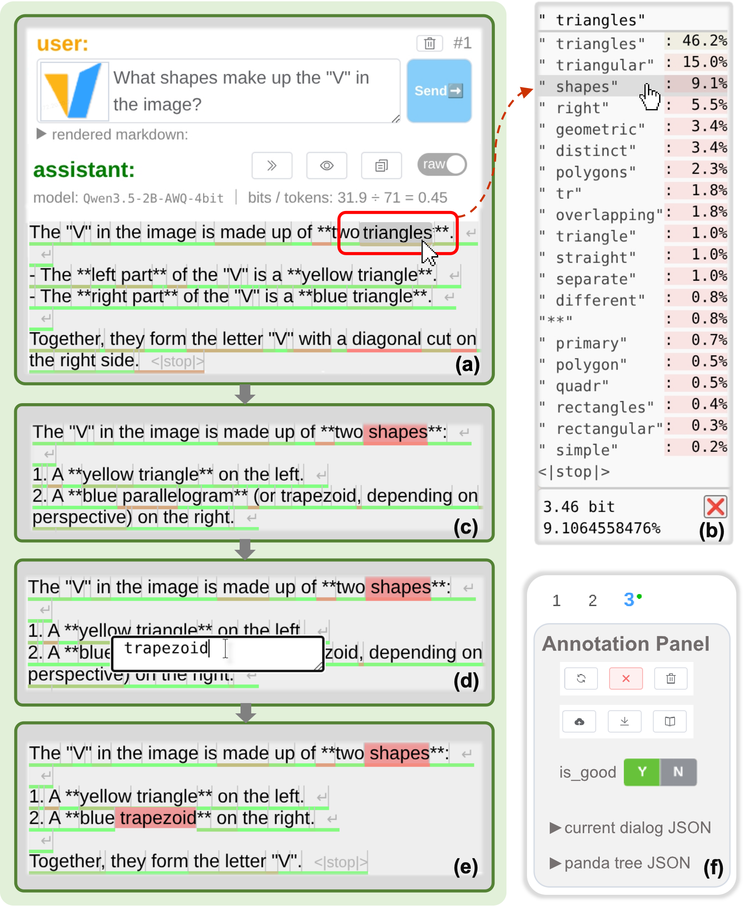

<head>
    <meta charset="UTF-8">
    <title>Panda-CVL: Can LLMs Locate and Correct Erroneous Tokens?</title>
    <meta name="description" content="Panda-CVL: Can LLMs Locate and Correct Erroneous Tokens? A Vision-Language Dataset and Benchmark for Token-Level Correction">
    <meta name="keywords" content="onPanda, Panda-CVL, on-policy data, token-level correction, process reward">
    <meta name="viewport" content="width=device-width, initial-scale=1">
    <meta name="image" content="https://on-panda.github.io/research/img/fig1_UI-v4.png">
    <meta property="og:title" content="Panda-CVL: Can LLMs Locate and Correct Erroneous Tokens?" />
    <meta property="og:description" content="Panda-CVL: Can LLMs Locate and Correct Erroneous Tokens? A Vision-Language Dataset and Benchmark for Token-Level Correction" />
    <meta property="og:image" content="https://on-panda.github.io/research/img/fig1_UI-v4.png" />
    <meta name="twitter:card" content="summary_large_image">
    <meta property="twitter:domain" content="on-panda.github.io">
    <meta property="twitter:url" content="https://on-panda.github.io/research">
    <meta name="twitter:title" content="Panda-CVL: Can LLMs Locate and Correct Erroneous Tokens?">
    <meta name="twitter:description" content="Panda-CVL: Can LLMs Locate and Correct Erroneous Tokens? A Vision-Language Dataset and Benchmark for Token-Level Correction">
    <meta name="twitter:image" content="https://on-panda.github.io/research/img/fig1_UI-v4.png">
</head>

Panda-CVL: Can LLMs Locate and Correct Erroneous Tokens? 
 
A Vision-Language Dataset and Benchmark for Token-Level Correction

<!-- Lei Yang1 &nbsp;&nbsp;&nbsp; Mengyin Liu1,2 &nbsp;&nbsp;&nbsp; Jia Wang1 &nbsp;&nbsp;&nbsp; Hangyu Guo1 &nbsp;&nbsp;&nbsp; Liang Zhao1 &nbsp;&nbsp;&nbsp; Zheng Ge1   
Kang an1 &nbsp;&nbsp;&nbsp; Binxing Jiao1 &nbsp;&nbsp;&nbsp; Qi Han1 &nbsp;&nbsp;&nbsp; Daxin Jiang1 &nbsp;&nbsp;&nbsp; Siqi Shen2 &nbsp;&nbsp;&nbsp; Xiangyu Zhang1 -->

  1
  
    &nbsp;&nbsp;&nbsp;&nbsp;&nbsp;&nbsp;&nbsp;&nbsp;
  2
  

 

<!-- Paper 📄 | Code 👨‍💻 | Demo 🎮 | Blog 📝 | Tweet 💬 | Poster 🖼️ -->

<!-- ### Paper 📄 | [Code 👨‍💻](https://github.com/on-panda/on-panda) | [Video ▶️](https://wvixbzgc0u7.feishu.cn/wiki/Zurxw3nX4iulXRk6Ze2c7RZ3nQp#share-XdTjdn9B4oxvgSxS0F3c4rAcn8b) | [Demo 🐼](https://on-panda.diyer22.com/) | Dataset 📁 -->

<!-- ### Token-Level Correction -->

The token-level correction interface used for annotating Panda-CVL   
For details about the annotation tool, see [onPanda](https://on-panda.github.io/research/)

 

**TL;DR:** We release the multimodal Panda-CVL dataset with an accompanying benchmark, providing public resources for research on token-level correction data.

---

<!-- 
### Abstract 中文

我们发布了数据集 Panda-CVL 用于评测模型的 token-level correction 的能力: 给模型输入一个问题和回答对，模型首先需要判断这个回答是否合格——如果模型认为回答需要纠正，则模型需要定位回答中首个不恰当的 token 的位置，将其更正为合适的 token。这样，后续步骤便可以让 policy model 基于正确的前缀 + 合适的 token 做续写，以最终生成合格的回答。
之前的数据都只是判断错误出现在哪个 step，我们做了两个改进， 1 将错误定位的细粒度提升到了 token-level 。 2 模型不仅要告知哪个 token 不恰当，还要模型指出应该改为哪一个正确的 token。
Panda-CVL 由标注员使用 onPanda 标注工具标注，主要在 中文 VL 数据上标注，但也提供了纯英文的子集 Panda-MultiRef-21 以单独评测模型的英文 token-level 能力。
Panda-CVL 包含了训练集，使得大家能使用 Panda-CVL 训练集强化模型的 token-level correction 能力。
我们还通过受控实验，分析了 token-level correction 在不同标注员间的一致性。

 -->

### Abstract

<!-- 
TODO
### Leadboard of Panda-CVL-test

### Leadboard of Panda-MultiRef-21 (English)

 -->

---
### Common Questions

<!-- 

 -->

Q1: 为什么选择 Vision-Language 数据，而不是纯文本？  
A1:
- 因为纯文本数据模型太强了，聚集专家在难题上做大规模注并提供监督信号是一件比较困难的事
- 而在许多 Vision-Language 任务上，模型仍然不如人类，所以正常人类标注员就能标得动，并提供有效的监督信号

Q2: 为什么 Panda-CVL 大多数都是中文数据？  
A2: 
- Panda-CVL 是从内部标注的生产数据中筛选出适合公开的子集组成的，而我们标注员的母语都是中文
- 我们还提供了纯英文的 Panda-CVL 的子集—— [Panda-MultiRef-21](https://github.com/on-panda/Panda-MultiRef-21)，由擅长英文的标注员标注，共包含 506 个 token-level correction 操作，可用于评估模型的英文 token-level correction 能力

---

### Resources

- Paper: comming soon
- [Python library](https://github.com/on-panda/on-panda-python)
- [`panda.json` example](https://github.com/on-panda/on-panda-example-data/tree/main/panda_json)
- [Live demo](https://on-panda.diyer22.com/): To load `panda.json`
- Panda-CVL dataset and benchmark: comming soon
- [Panda-MultiRef-21](https://github.com/on-panda/Panda-MultiRef-21): A Small Dataset for Studying the Distribution of Token-Level Corrections

<!-- Google tag (gtag.js) for Panda-CVL -->

