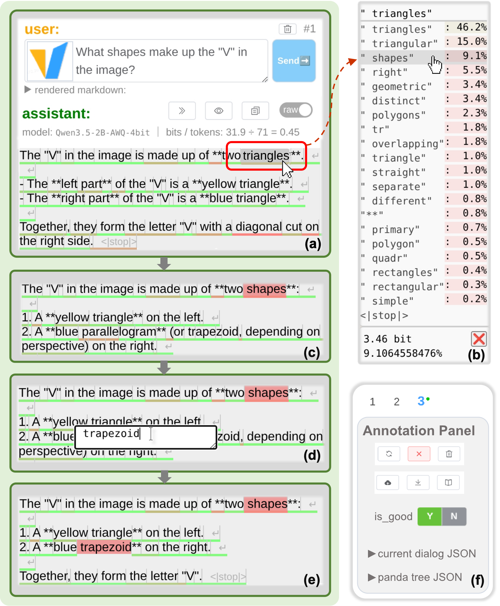
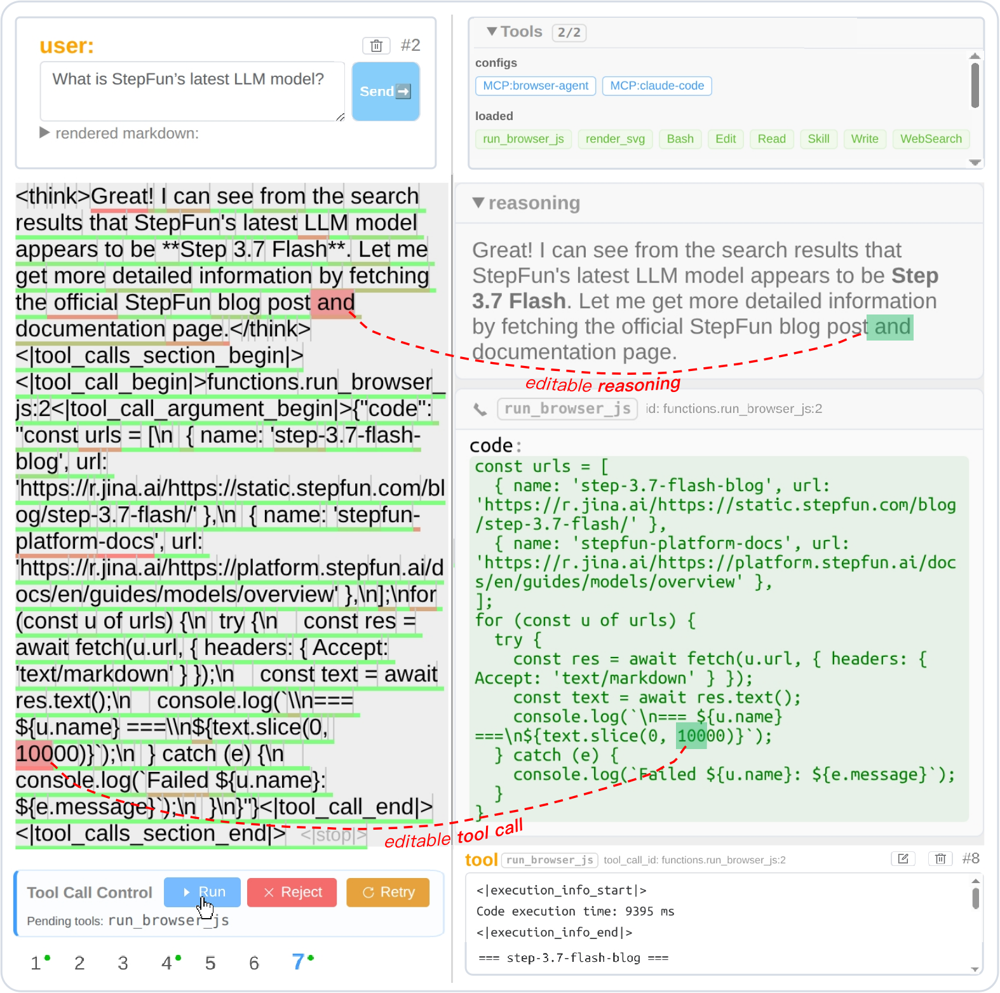
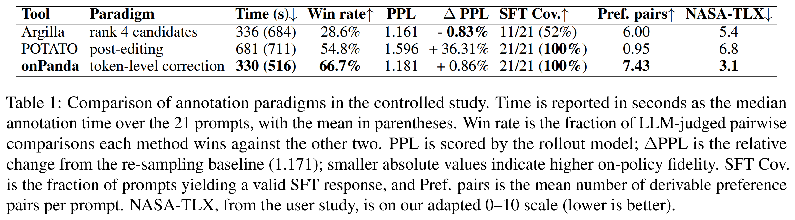

<head>
    <meta charset="UTF-8">
    <title>onPanda: Efficient Annotation of On-Policy Alignment Data</title>
    <meta name="description" content="Efficient Annotation of On-Policy Alignment Data for LLMs and Agents via Token-Level Correction">
    <meta name="keywords" content="onPanda, annotation tool, on-policy data, token-level correction, agent trajectory annotation">
    <meta name="viewport" content="width=device-width, initial-scale=1">
    <meta name="image" content="https://on-panda.github.io/research/img/fig1_UI-v4.png">
    <meta property="og:title" content="onPanda: Efficient Annotation of On-Policy Alignment Data" />
    <meta property="og:description" content="Efficient Annotation of On-Policy Alignment Data for LLMs and Agents via Token-Level Correction" />
    <meta property="og:image" content="https://on-panda.github.io/research/img/fig1_UI-v4.png" />
    <meta name="twitter:card" content="summary_large_image">
    <meta property="twitter:domain" content="on-panda.github.io">
    <meta property="twitter:url" content="https://on-panda.github.io/research">
    <meta name="twitter:title" content="onPanda: Efficient Annotation of On-Policy Alignment Data">
    <meta name="twitter:description" content="Efficient Annotation of On-Policy Alignment Data for LLMs and Agents via Token-Level Correction">
    <meta name="twitter:image" content="https://on-panda.github.io/research/img/fig1_UI-v4.png">
</head>

# onPanda: Efficient Annotation of On-Policy Alignment Data for LLMs and Agents via Token-Level Correction

Lei Yang1 &nbsp;&nbsp;&nbsp; Mengyin Liu1,2 &nbsp;&nbsp;&nbsp; Jia Wang1 &nbsp;&nbsp;&nbsp; Hangyu Guo1 &nbsp;&nbsp;&nbsp; Liang Zhao1 &nbsp;&nbsp;&nbsp; Zheng Ge1   
Kang an1 &nbsp;&nbsp;&nbsp; Binxing Jiao1 &nbsp;&nbsp;&nbsp; Qi Han1 &nbsp;&nbsp;&nbsp; Daxin Jiang1 &nbsp;&nbsp;&nbsp; Siqi Shen2 &nbsp;&nbsp;&nbsp; Xiangyu Zhang1

  1
  
    &nbsp;&nbsp;&nbsp;&nbsp;&nbsp;&nbsp;&nbsp;&nbsp;
  2
  

 

<!-- Paper 📄 | Code 👨‍💻 | Demo 🎮 | Blog 📝 | Tweet 💬 | Poster 🖼️ -->

### Paper 📄 | [Code 👨‍💻](https://github.com/on-panda/on-panda) | [Video ▶️](https://wvixbzgc0u7.feishu.cn/wiki/Zurxw3nX4iulXRk6Ze2c7RZ3nQp#share-XdTjdn9B4oxvgSxS0F3c4rAcn8b) | [Demo 🐼](https://on-panda.diyer22.com/) | Dataset 📁
(WIP: Paper, Dataset comming soon)

<!-- ### Token-Level Correction -->

The token-level correction interface of onPanda
<!-- 
<b>The token-level correction interface of onPanda.</b> The annotator locates an inappropriate token, selects a better candidate or enters a free-form edit, and lets the model continue from the corrected prefix. Intermediate versions are retained automatically.
 -->

 

**TL;DR:** An interactive tool that efficiently annotates on-policy alignment data for LLMs and agents via a token-level locate--correct--continue loop, automatically capturing fine-grained supervision.

***Contributions of this paper:***
- We propose onPanda, an annotation tool centered on token-level correction for efficiently annotating LLM alignment data and agent trajectories that stay close to the rollout model's distribution.
- We experimentally validate onPanda's annotation efficiency and the on-policy fidelity of the produced data, and demonstrate its support for multimodal and agent-trajectory annotation.
- We release the multimodal Panda-CVL dataset with an accompanying benchmark, providing public resources for research on token-level correction data.

---

### Abstract

<em>
We present onPanda, an interactive tool for efficiently annotating LLM alignment data and agent trajectories. onPanda adopts token-level correction as its core interaction: while reading a model response, the annotator locates the first inappropriate token and either picks a substitute from the model's candidate tokens or types the correct text via free-form editing. The system then truncates everything after that position and continues generation from the corrected prefix, repeating this locate-correct-continue loop until a satisfactory response is obtained. This mechanism lets annotators precisely steer model outputs at low cost: experiments show that onPanda reduces annotation time by 52% over manual post-editing. Since the vast majority of tokens in the final response are generated by the model itself, the resulting data largely preserves the model's sampling distribution and is well suited for constructing on-policy SFT and preference data. Furthermore, the token-level corrections recorded during annotation provide fine-grained supervision with precise positions and naturally paired positive--negative samples. onPanda also connects to external tools and harnesses, enabling interactive trajectory annotation in realistic environments. In addition, we release Panda-CVL, a multimodal dataset annotated with onPanda, together with a benchmark for token-level correction.
</em>

---

### Agent Trajectory Annotation

<b>Annotating an agent trajectory with onPanda.</b> Reasoning and tool-call arguments remain editable at token level. Corrected tool calls can be executed in the connected environment, and the resulting trajectory continues from the corrected context.

---

### Comparison of Annotation Paradigms

---

### Resources

- Paper: comming soon
- [Source code](https://github.com/on-panda/on-panda)
- [Python library](https://github.com/on-panda/on-panda-python)
- [Demo video](https://wvixbzgc0u7.feishu.cn/wiki/Zurxw3nX4iulXRk6Ze2c7RZ3nQp#share-XdTjdn9B4oxvgSxS0F3c4rAcn8b)
- [Live demo](https://on-panda.diyer22.com/)
- Panda-CVL dataset and benchmark: comming soon

<!-- Google tag (gtag.js) -->

